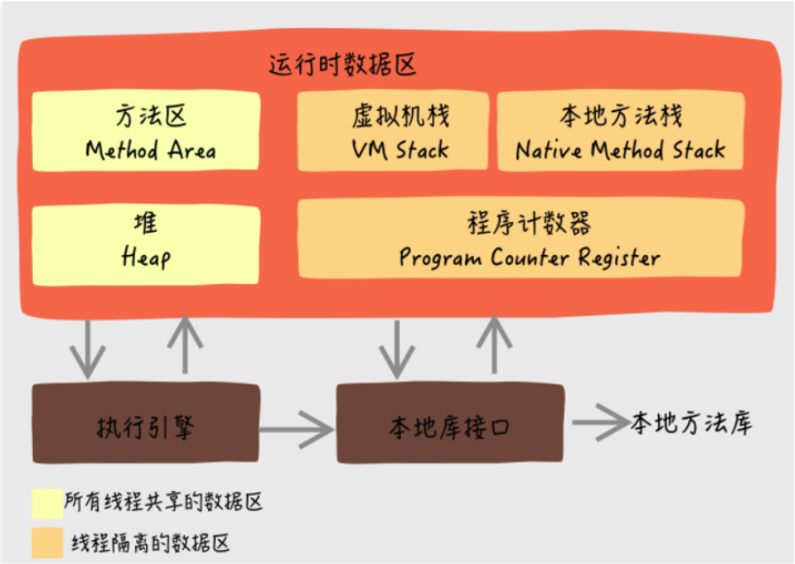

# Java 内存区域与内存溢出异常

## 运行时数据区域

> Java 虚拟机在执行 Java 程序的过程中会把它所管理的内存划分为若干个不同的数据区域。

### 程序计数器（线程私有）

程序计数器(Program Counter Register)是一块较小的内存空间，可以看作是**当前线程**所执行的字节码的行号指示器。

在虚拟机的概念模型里，字节码解释器工作时就是通过改变这个计数器的值来选取下一条需要执行的字节码指令，分支、循环、跳转、异常处理、线程恢复等
基础功能都需要这个计数器来完成。

为了线程切换后能恢复到正确的执行位置，每条线程都需要有一个独立的程序计数器，各条线程之间计数器互不影响，独立存储，这类内存区域为“
**线程私有**”的内存。

如果线程正在执行的是一个 Java 方法，计数器记录的是正在执行的虚拟机字节码指令的地址；如果正在执行的是 Native
方法，计数器值则为空(Undefined)。
**此内存区域是唯一一个在 Java 虚拟机规范中没有规定任何 OutOfMemoryError 情况的区域。**

### Java 虚拟机栈（线程私有）

与程序计数器一样，Java 虚拟机栈(Java Virtual Machine Stacks) 也是**线程私有**的，它的生命周期与线程相同。

虚拟机栈描述的是 Java 方法执行的内存模型：每个方法在执行的同时都会创建一个**栈帧**(Stack Frame) 用于存储局部变量表、操作数栈、动态链接、方
法出口等信息。每一个方法从调用直至执行完成的过程，就对应着一个栈帧在虚拟机栈中入栈到出栈的过程。

**局部变量表存放了编译器可知的各种基本数据类型**(boolean、byte、char、short、int、float、long、double)、**对象引用**(
reference类型，它不等同于对象本身，可能是一个指向对象起始地址的引用指针，也可能是指向一个代表对象的句柄或其他与此对象相关的位置) 和
returnAddress 类型（指向了一条字节码指令的地址）。

其中64位长度的long和 double 类型的数据会占用 2 个局部变量空间 (Slot)，其余的数据类型只占用1个。
**局部变量表所需的内存空间是栈编译期间完成分配**，当进入一个方法时，这个方法需要在帧中分配多大的局部变量空间是完全确定的，
在方法运行期间不会改变局部变量表的大小。

**在这个区域规定了两种异常情况：如果线程请求的栈深度大雨虚拟机允许的深度，将抛出 StackOverflowError 异常；如果虚拟机栈可以动态扩展，如果扩展到
无法申请到足够的内存，就会抛出 OutOfMemoryError 异常。**

### 本地方法栈（线程私有）

本地方法栈(Native Method Stack) 与虚拟机栈所发挥的作用是非常相似的，之间的区别不过是虚拟机栈为虚拟机执行 Java 方法（也就是字节码）服务，
而本地方法栈则为虚拟机使用到的 Native 方法服务。

**与虚拟机栈一样，本地方法栈区域也会抛出 StackOverflowError 和 OutOfMemoryError 异常。**

### Java 堆（线程共享）

对大多数应用来说，Java 堆是 Java 虚拟机所管理的内存中最大的一块。Java堆是被所有线程共享的一块内存区域，在虚拟机启动时创建。 此内存区域的唯一目的就是存放对象实例。

Java 堆是垃圾收集器管理的主要区域，因此很多时候也被称做“**GC堆**”。
从内存回收的角度来看，由于现在收集器基本都采用分代收集算法，所以 Java 堆中还细分为：**新生代和老年代**；再细致一点的有 E**den 空间、From Survivor 空间、
To Survivor 空间等**。

**如果在堆中没有内存完成实例分配，并且堆也无法再扩展时，将会抛出 OutOfMemoryError 异常。**

### 方法区（线程共享）

**方法区(Method Area)与Java 堆一样，是各个线程共享的内存区域**，它用于存储已被虚拟机加载的类信息、常量、静态变量、即时编译器编译后的代码等数据。

**当方法区无法满足内存分配需求时，将抛出 OutOfMemoryError 异常。**

### 运行时常量池

运行时常量池(Runtime Constant Pool)是方法区的一部分。Class 文件中除了有类的版本、字段、方法、接口等描述信息外，还有一项信息是常量池(Constant Pool Table)，
用于存放**编译期生产**的各种字面量和符号引用，这部分内容将在类加载后进入方法区的运行时常量池中存放。

运行时常量池相对于Class文件常量池的另外一个重要特征是具备动态性，Java语言并不要求常量一定只有编译器才能产生，
也就是并非预置入Class文件中常量池的内容才能进入方法区运行时常量池，运行期间也可能将新的常量放入池中，这种特性被开发人员利用的比较多的便是 String 类的 intern() 方法。

**当常量池无法再申请到内存时会抛出 OutOfMemoryError 异常。**

### 直接内存

直接内存(Direct Memory)并不是虚拟机运行时数据区的一部分，也不是 Java 虚拟机规范中定义的内存区域。但是这部分内存也被频繁地使用，而且也可能导致
**OutOfMemoryError** 异常出现。

## 虚拟机对象

### 对象的创建

> 语言层面，创建对象通常仅仅是一个 new 关键字而已，而在虚拟机中，对象的创建是怎样的一个过程呢？

虚拟机遇到一条 new 指令时，首先将去检查这个指令的参数是否能在常量池中定位到一个类的**符号引用**，并且检查这个符号引用代表的类是否已被加载、解析和初始化过。
如果没有，那必须先执行相应的类加载过程。

在类加载检查通过后，虚拟机将为新生对象分配内存。为对象分配空间的任务等同于把一块确定大小的内存从Java堆中划分出来。
- 指针碰撞：如果Java堆中内存是绝对规整的，
所有用过的内存都放在一边，空闲的内存放在另一边，中间放着一个指针作为分界点的指示器，那所分配内存就仅仅是把那个指针向空闲空间那边挪动一段与对象大小相等的距离。

- 空闲列表：如果Java堆中的内存并不是规整的，已使用的内存和空闲的内存相互交错，那就没有办法简单地进行指针碰撞了，虚拟机就必须维护一个列表，记录上
哪些内存块是可用的，在分配的时候从列表中找到一块足够大的空间划分给对象实例，并更新列表上的记录。

选择哪种分配方式由 Java 堆是否规整决定，而Java堆是否规整又由所采用的垃圾收集器是否带有压缩功能决定。

除划分可用空间外，还有另外一个需要考虑的问题是对象创建在虚拟机中是非常频繁的行为，即使是仅仅修改一个指针所指向的位置，在并发的情况下也不是线程安全的。
解决这个问题有两种方案：
1. 对分配内存空间的动作进行同步处理
2. 把内存分配的动作按照线程划分在不同的空间之中进行，即每个线程在Java堆中预先分配一小块内存，称为本地线程分配缓存(Thread Local Allocation Buffer, TLAB)。
哪个线程要分配内存，就在哪个线程的TLAB上分配，只有TLAB用完并分配新的TLAB时，才需要同步锁定。

接下来，虚拟机要对对象进行必要的设置，例如这个对象是哪个类的实例、如何才能找到类的元数据信息、对象的HashCode、对象的GC分代年龄等信息。
这些信息存放在对象的对象头之中。

从虚拟机的角度来看，一个新的对象已经产生了，但从Java程序的视角来看，对象创建才刚刚开始————<init> 方法还没有执行，所有的字段都还为零。
一般来说，执行 new 指令之后会接着执行<init>方法，把对象按照意愿进行初始化，这样一个可用的对象才算完全产生。

### 对象的内存布局

对象在内存中存储的布局可以分为3块区域：对象头(Header)、实例数据(Instance Data)和对齐填充(Padding)。

