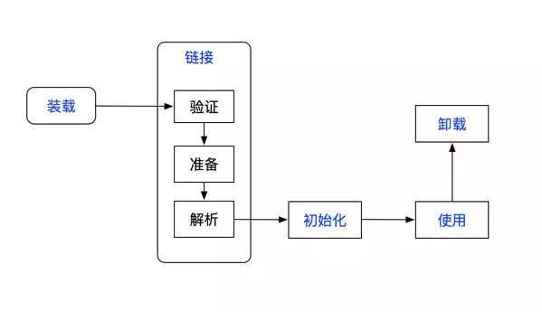

# 类加载机制

## 类加载的时机

> 类从被加载到虚拟机内存中开始，到卸载出内存为止，它的整个生命周期包括：加载(Loading)、验证(Verification)、准备(Preparation)、
> 解析(Resolution)、初始化(Initialization)、使用(Using)和卸载(Unloading)7个阶段。
> 
> 其中验证、准备、解析3个部分统称为连接(Linking)

加载、验证、准备、初始化和卸载这5个阶段的顺序是确定的，类的加载过程必须按照这种顺序按部就班地开始，而解析阶段则不一定：它在某种情况下可以在初始化阶段之后再开始，
这是为了支持Java语言的运行时绑定（也称为动态绑定）。

对于初始化，有且只有5种情况必须立即对类进行“初始化”（而加载、验证、准备自然需要在此之前开始）：
1. 遇到 `new`、`getstatic`、`putstatic`或 `invokestatic`这4条字节码指令时，如果类没有进行过初始化，则需要先触发其初始化。